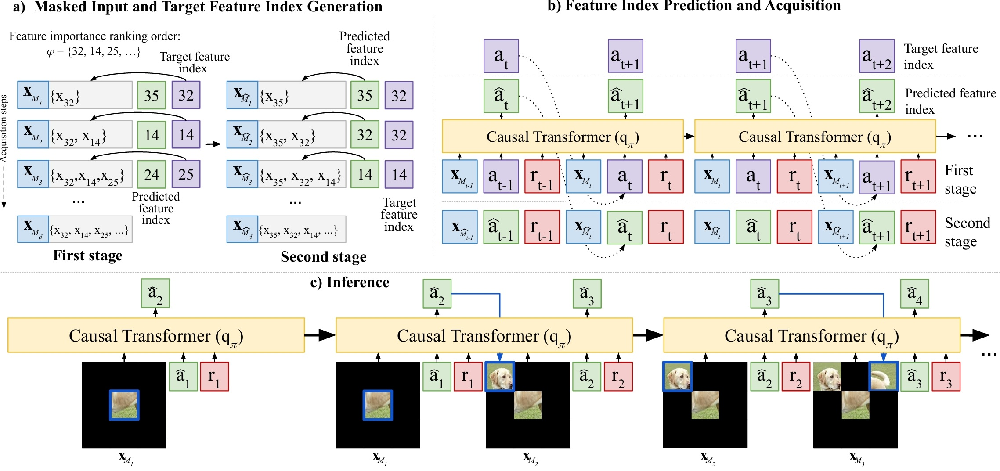

# Active feature acquisition via explainability-driven ranking (ICML 2025)
This is the official repository of work titled, "Active feature acquisition via explainability-driven ranking", accepted in ICML 2025 (https://icml.cc/virtual/2025/poster/45710).

In many real-world settings (e.g., medicine), collecting every feature is infeasible due to time, cost, and resource constraints. We propose an active feature acquisition (AFA) method that uses local explanations to rank features per instance and a decision-transformer policy to sequentially acquire the next most informative feature. Across multiple datasets, this explainability-driven policy improves predictive accuracy while reducing acquisition cost versus state-of-the-art AFA baselines.

||
|:--:| 
| a) Our training strategy consists of two stages. This figure shows how the masked inputs and target feature indices are generated during the first and second stages for a given feature importance ranking $\varphi$. In the first stage, features are selected based on their ranking order $\varphi$. In the second stage, features are acquired by the policy network ($q_\pi$). During the first stage, the next feature in the ranking is the target feature index. However, in the second stage, the target feature is the feature index having the highest ranking order among the ones that are not acquired; because of this, the target feature remains the same until it is acquired. b) This part of the figure shows how the policy network $q_\pi$, based on the decision transformer [1], processes the masked inputs during training for both stages. Sequential data with a context length $\ell$, set to 2 in this case, is fed into $q_\pi$. At each time step, $q_\pi$ receives three tokens: the masked input (**x**<sub>M<sub>t</sub></sub>), action (**a**<sup></sup><sub>t</sub>) and reward (**r**<sub>t</sub>). The action token represents the index of the last acquired feature, and the reward is the output of the predictor network. To ensure causality, future tokens are masked while $q_\pi$ predicts the next feature to acquire at any time step. c) This figure illustrates the inference stage for image inputs in the causal transformer model, where predicted features (or patches) are progressively acquired in a series of sequential acquisition steps.|

## Prerequisites
Create a conda environment using the "afa_env.yml" file:

```bash
conda env create -f afa_env.yml
```
Then, activate:

```bash
conda activate afa_env
```

## Evaluation
This repo provides separate folders for the image and tabular experiments. Each folder includes all scripts, and instructions needed to run our method end to end (see the folder-level README for setup and commands).

## References
[1] Chen, Lili, et al. "Decision transformer: Reinforcement learning via sequence modeling." Advances in neural information processing systems 34 (2021): 15084-15097.


